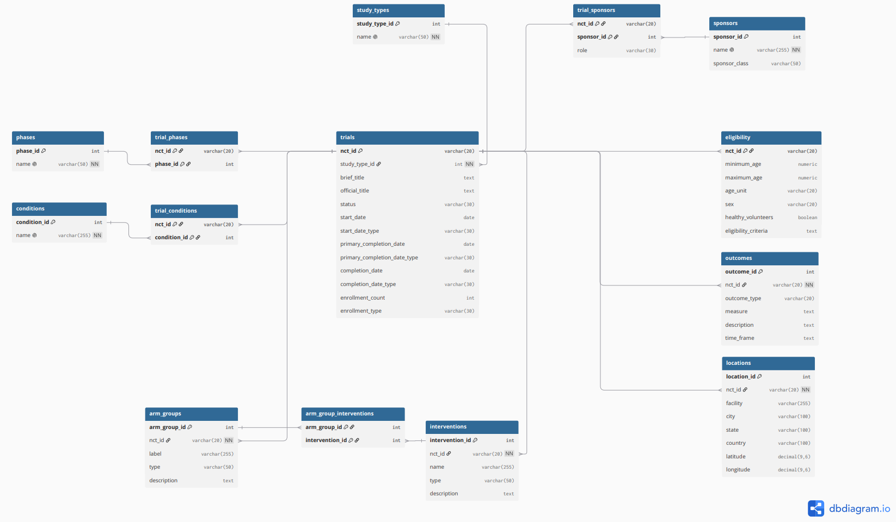

# TrialScope

Clinical trials analytics and data science platform built using
ClinicalTrials.gov data.

## Overview

TrialScope is an end-to-end data analytics and data science project
focused on exploring clinical trial activity, study characteristics,
interventions, sponsors, outcomes, and geographic trends.

The project uses data from ClinicalTrials.gov and combines data
engineering, SQL analytics, data visualization, and machine learning.

## Objectives

- Analyze clinical trial trends over time
- Explore trial characteristics and study design
- Analyze sponsors, interventions, and conditions
- Explore the geographic distribution of clinical research
- Analyze clinical outcomes and endpoints
- Build predictive models for clinical trial characteristics
- Apply NLP techniques to clinical trial text

## Tech Stack

- Python
- Pandas
- PostgreSQL
- SQL
- Power BI
- Scikit-learn
- NLP
- Git

---

## Project Structure

The project is developed progressively, from API exploration and
data validation to relational modeling, data ingestion, analytics,
and data science.

### 1. Data Exploration

Initial exploration of the ClinicalTrials.gov API and its
clinical trial data structure.

The exploration notebook documents:

- API interaction and data retrieval
- Clinical trial JSON structure
- Study metadata
- Study design and phases
- Sponsors and interventions
- Eligibility criteria
- Study locations
- Primary and secondary outcomes

**[Exploration Notebook](notebooks/01_api_exploration.ipynb)**

---

### 2. Data Validation

Validation of the ClinicalTrials.gov data structure and the
observations identified during the exploration phase.

The validation notebook verifies:

- API module presence and optional modules
- Field presence and missing values
- Categorical values
- Partial date precision and date types
- Enrollment information
- Age values and age units
- Standardized age categories
- Relationship cardinalities
- Sponsors and collaborators
- Locations and outcomes
- Arm groups and interventions

The validation results are used to confirm the relational data model
and define how the ingestion process should handle missing,
optional, and non-applicable values.

**[Validation Notebook](notebooks/02_data_validation.ipynb)**

---

### 3. Data Dictionary

A structured data dictionary documenting the fields selected
for the analytical data model, their meaning, source, and
intended use.

**[Data Dictionary](docs/data_dictionary.md)**

---

### 4. Data Model

The project uses a relational data model designed to transform
the hierarchical ClinicalTrials.gov data into an analytical
PostgreSQL database.

The model includes clinical trials, study types, phases,
conditions, sponsors, interventions, study arms, eligibility,
standardized age categories, locations, and outcomes.

#### Editable ERD

The database model is defined using DBML, allowing the model to be
modified and regenerated as the project evolves.

**[ERD Source (DBML)](docs/erd.dbml)**

#### ERD Diagram

#### PostgreSQL Schema

The relational database schema is implemented in PostgreSQL
using primary keys, foreign keys, one-to-many relationships,
many-to-many bridge tables, and a one-to-one eligibility relationship.

**[PostgreSQL Schema](sql/schema.sql)**

---

## Project Status

Currently in development.

### Completed

- [x] Initial ClinicalTrials.gov API exploration
- [x] Data validation
- [x] Data dictionary
- [x] Relational data model
- [x] Entity Relationship Diagram
- [x] PostgreSQL database schema

### Next

- [ ] Data ingestion pipeline
- [ ] Data cleaning and transformation
- [ ] SQL analytical queries
- [ ] Power BI dashboard
- [ ] Statistical analysis
- [ ] Machine learning
- [ ] NLP analysis
